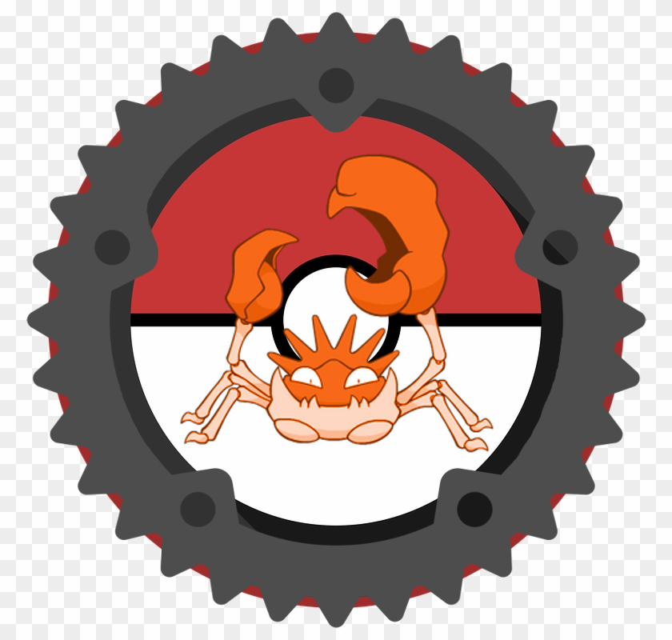

<div align="center">

```
 ██████╗ ██╗  ██╗██╗██████╗ ███████╗██████╗ ███████╗██╗  ██╗
██╔═══██╗╚██╗██╔╝██║██╔══██╗██╔════╝██╔══██╗██╔════╝╚██╗██╔╝
██║   ██║ ╚███╔╝ ██║██║  ██║█████╗  ██║  ██║█████╗   ╚███╔╝ 
██║   ██║ ██╔██╗ ██║██║  ██║██╔══╝  ██║  ██║██╔══╝   ██╔██╗ 
╚██████╔╝██╔╝ ██╗██║██████╔╝███████╗██████╔╝███████╗██╔╝ ██╗
 ╚═════╝ ╚═╝  ╚═╝╚═╝╚═════╝ ╚══════╝╚═════╝ ╚══════╝╚═╝  ╚═╝
```



*A high-performance, terminal-based Pokédex CLI built with Rust*


</div>

---

## Overview

**OxideDex** leverages the PokéAPI to provide real-time stats, types, and abilities with a sleek, color-coded terminal interface — and zero local database overhead.

---

## Features

- 🔍 **Lookup** — Search by Pokémon name or National Dex ID
- ⚡ **Asynchronous Architecture** — Powered by `tokio` and `rustemon` for non-blocking API requests
- ✨ **Formatted UI** — Automatic title-casing and kebab-case cleaning for a polished look
- 🎨 **Dynamic Color Palette** — Historically accurate type colors optimized for modern terminal emulators
- 📏 **Unit Conversion** — Automatic conversion of internal API units to standard Metric (m/kg)
- 🖼️ **Sprite Rendering** — Displays Pokémon sprites inline using true-color Unicode half-blocks
- 📊 **Base Stat Visualization** — ASCII progress bars for all six stats *(in progress)*

---

## Tech Stack

| Crate | Purpose |
|---|---|
| `rustemon` | PokéAPI client |
| `tokio` | Async runtime |
| `colored` | Terminal type color styling |
| `reqwest` | HTTP sprite fetching |
| `image` | Image decoding |
| `viuer` | Terminal sprite rendering |

**Environment:** Developed on a Surface Pro 7 (Windows 11) using WSL2 with a minimal Kali Linux distribution.

---

## Installation

Requires the Rust toolchain ([install here](https://rustup.rs/)).

```bash
# Clone the repository
git clone https://github.com/brockel27/OxideDex.git
cd OxideDex

# Build the project
cargo build --release

# Run the program
./target/release/OxideDex pikachu
```

---

## Usage

```bash
# Search by name
cargo run -- lucario

# Search by ID
cargo run -- 448
```

---

## Terminal Requirements

A truecolor terminal is recommended for the best experience.

| Platform | Recommended |
|---|---|
| Windows | Windows Terminal (not cmd.exe or legacy PowerShell) |
| macOS | iTerm2 or Terminal.app (macOS 10.15+) |
| Linux/WSL | Any modern emulator with `COLORTERM=truecolor` |

Verify truecolor support:

```bash
echo $COLORTERM  # should print "truecolor"

# Verify color output
cargo test print_color_palette -- --nocapture
```

---

## Milestone Progress

| Milestone | Description | Status |
|---|---|---|
| M1 | Basic lookup + type color mapping | ✅ |
| M2 | Title-casing + display formatting | ✅ |
| M3 | Unit conversion (height/weight) | ✅ |
| M3.5 | Terminal sprite rendering | ✅ |
| M4 | Base stat ASCII visualization | 🔄 |

---

## Sources

- [Rustemon docs](https://docs.rs/rustemon/latest/rustemon/)
- [Cargo Cheatsheet](https://github.com/johnnysecond/rust-cargo-cheatsheet)

---

<div align="center">
<sub>Built with ⚙️ and ❤️ as a Rust learning project</sub>
</div>
